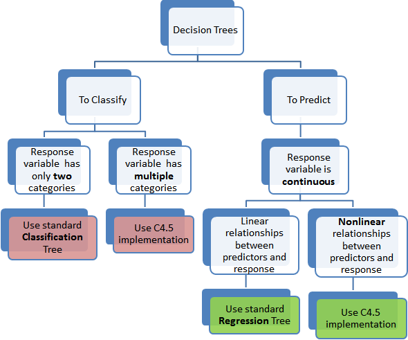

# Methods Used

A number of analytical methods are available for use such as decision trees, classification trees, linear-regression.  Not all of these techniques makes sense for our purpouses as they are used to predict diffrent types of information.

The main goal of our analysis is to predict how risky a particular car is using the `symboling` scale: [-3, -2, -1, 0, +1, +2, +3]. Since this output variable has class levels, and is not continuous, the appropriate analysis method is a classification tree. Note that if we to not be using the `symboling` scale, then a regression tree would be appropriate as it would have output a continuous risk variable. The below chart graphically summarizes this nicely.

